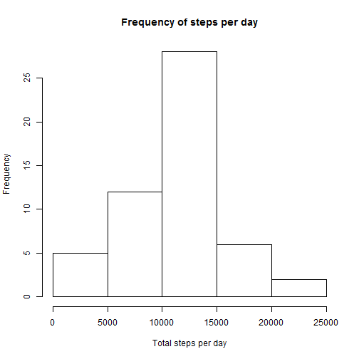
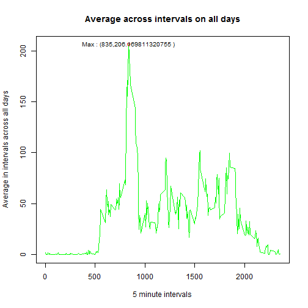
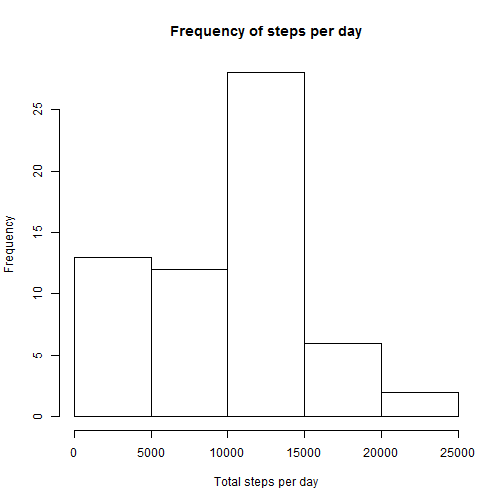
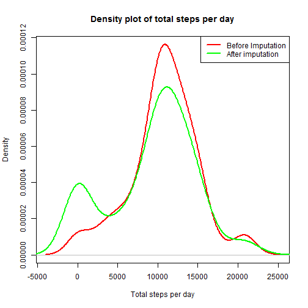
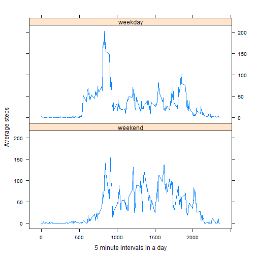

## Loading and preprocessing the data

```r
library(dplyr)
library(xtable)
library(lattice)
options(xtable.comment = FALSE)
data<-read.csv("activity.csv", header=TRUE)
data<-tbl_df(data)
data$date<-as.Date(data$date, "%Y-%m-%d")
# q1 is the data frame for plot1 (Histogram)
q1<-group_by(data, date)
q1<-na.omit(q1)
q1<-mutate(q1, tspm=sum(steps))
xtable <- function(x, ...) {
   for (i in which(sapply(x, function(y) !all(is.na(match(c("POSIXt","Date"),class(y))))))) x[[i]] <- as.character(x[[i]])
   xtable::xtable(x, ...)
}
plot1<-unique(q1[ ,c(2,4)])
# q2 is the data for plot2 (line plot)
# Group by interval
q2<-group_by(data,interval)
q2<-na.omit(q2)
# compute average across intervals for all days.
q2<-mutate(q2, avg=mean(steps))
# Imputing values
naSet<-data[is.na(data$steps), ]
naSet$steps<-0
valSet<-data[!is.na(data$steps), ]
q3<-rbind(naSet,valSet)
q4<-q3
q3<-group_by(q3, date)
q3<-mutate(q3, imp_tspm=sum(steps))
# Weekend and weekday calculations
weekdays1 <- c('Monday', 'Tuesday', 'Wednesday', 'Thursday', 'Friday')
q4$wDay <-  factor((weekdays(q4$date) %in% weekdays1)+1L,
      levels=1:2, labels=c('weekend', 'weekday'))
q4<-group_by(q4, interval, wDay)
q4<-mutate(q4, wavg = mean(steps))
```
# What is mean total number of steps taken per day?
## Histogram of total steps taken per day

```r
hist(plot1$tspm,xlab="Total steps per day", main="Frequency of steps per day")
```

 
## Report of mean and median of total steps per day

```r
mn<-mean(plot1$tspm)
md<-median(plot1$tspm)
```
MEAN   ::: 1.0766189 &times; 10<sup>4</sup>  
MEDIAN ::: 10765
# What is the average daily activity pattern?

```r
plot2<-unique(q2[ ,c(3,4)])
plot(plot2$interval,plot2$avg, type="l", xlab="5 minute intervals", ylab="Average in intervals across all days", main="Average across intervals on all days", col="green")
m<-max(plot2[ ,2])
mp<-plot2[plot2$avg==m ,]
points(mp$interval,mp$avg,col="red")
mt<- c("Max : (", mp$interval,",",mp$avg," )")
mt<-paste(mt,collapse="")
text(mp$interval,mp$avg,mt,cex=.8)
```

 

# Imputing missing values
## Total number of missing values

```r
t<-data.frame(nrow(filter(data, is.na(interval) | is.na(date) | is.na(steps))))
names(t)<-c("Number of rows with missing values")
print(xtable(t), type="html", include.rownames=FALSE)
```

<table border=1>
<tr> <th> Number of rows with missing values </th>  </tr>
  <tr> <td align="right"> 2304 </td> </tr>
   </table>
## (Imputed values) Histogram of the total number of steps taken each day
### Imputing value 0. There are no steps recorded for whole days of missing values.

```r
plot3<-unique(q3[ ,c(2,4)])
hist(plot3$imp_tspm,xlab="Total steps per day", main="Frequency of steps per day")
```

 

```r
mn_imp<-mean(plot3$imp_tspm)
md_imp<-median(plot3$imp_tspm)
```
MEAN   ::: 9354.2295082  
MEDIAN ::: 1.0395 &times; 10<sup>4</sup>

## Differences in mean and median before and after imputation
### Mean and Median have decreased after imputation
Mean Diff ::: 1411.959171  
Median Diff ::: 370
## Density spread before and after imputation

```r
plot(density(plot1$tspm), type="l", col="red", lwd=2.5, xlab="Total steps per day", main="Density plot of total steps per day")
lines(density(plot3$imp_tspm), type="l", col="green", lwd=2.5)
legend("topright", c("Before Imputation","After imputation"),lty=c(1,1),lwd=c(2.5,2.5),col=c("red","green"))
```

 
## Are there differences in activity patterns between weekdays and weekends?

```r
plot4<-unique(q4[ ,c(3,4,5)])
xyplot(wavg ~ interval | wDay, data = plot4, layout = c(1, 2), type="l", xlab="5 minute intervals in a day", ylab="Average steps")
```

 
